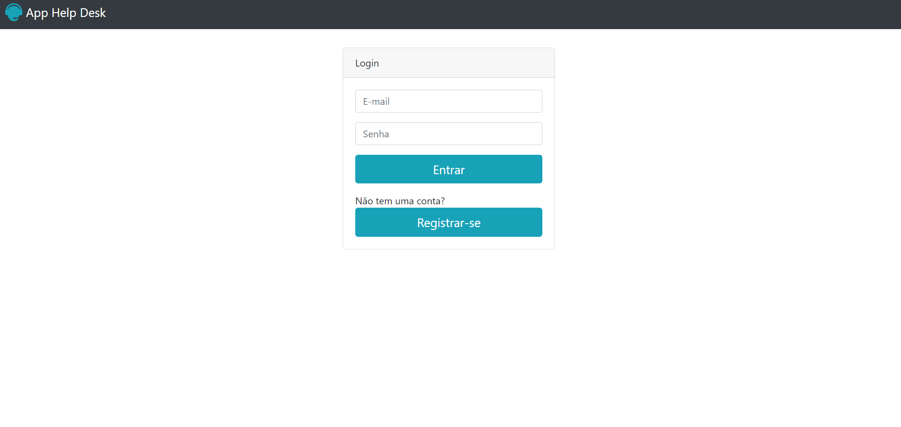

### Oi Galera, sejam bem vindos ao meu perfil! 👋👋👋

<!--
**BrunoSantosLira/BrunoSantosLira** is a ✨ _special_ ✨ repository because its `README.md` (this file) appears on your GitHub profile.

Here are some ideas to get you started-->

- 🌱  Estudando atualmente: JavaScript e PHP
- 📫 Contate-me por: 
     *brunomasterchif@gmail.com 
     *@brunosantoslira25
     
- 😄 Pronouns: Ele/Dele
- 🎧🎮
--> 

 
 
 

      

       

     

  
  
 
    
 
    
    

    

    <h2>Projeto em destaque</h2>
        
    

